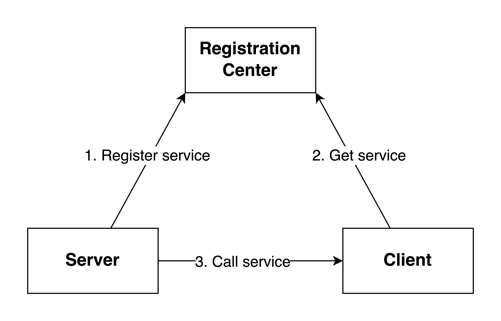

# Ethan

Ethan is a high-performance, Java-based RPC framework. It refers to the design of Apache Dubbo.

## Architecture

- **Registration Center** is a crucial component in an RPC (Remote Procedure Call) framework. It acts as a service
  directory where services register themselves with their metadata, such as service names, addresses, and protocols.
- **Server** hosts the actual implementation of remote procedures or services.
- **Client** is the entity that initiates requests to remote services provided by servers. 
